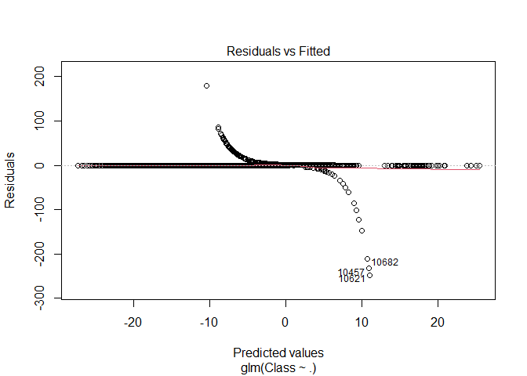
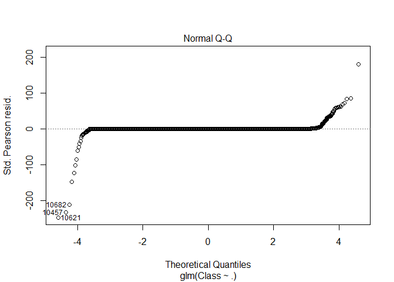
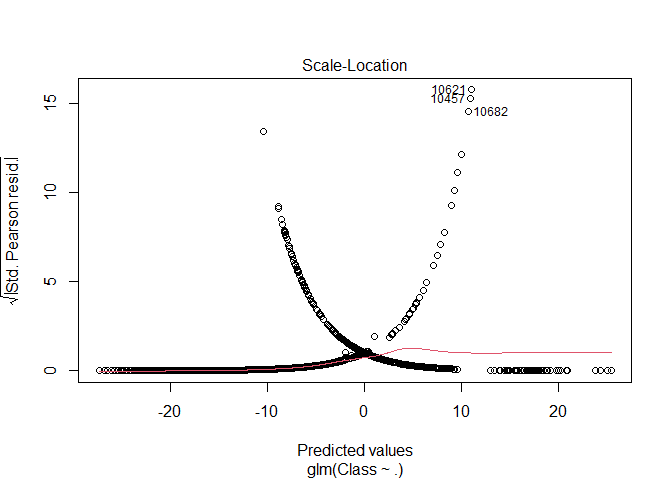
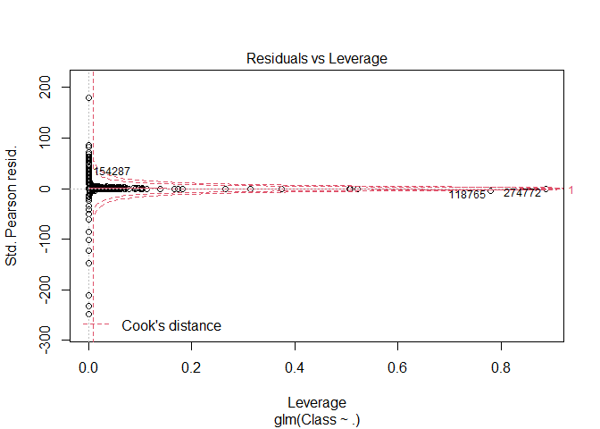
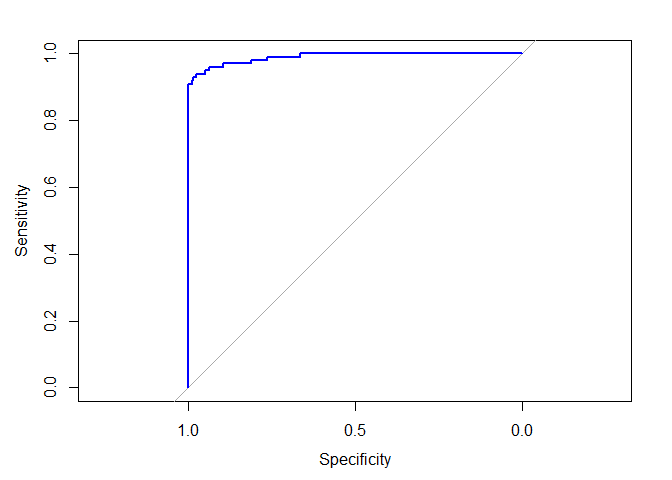
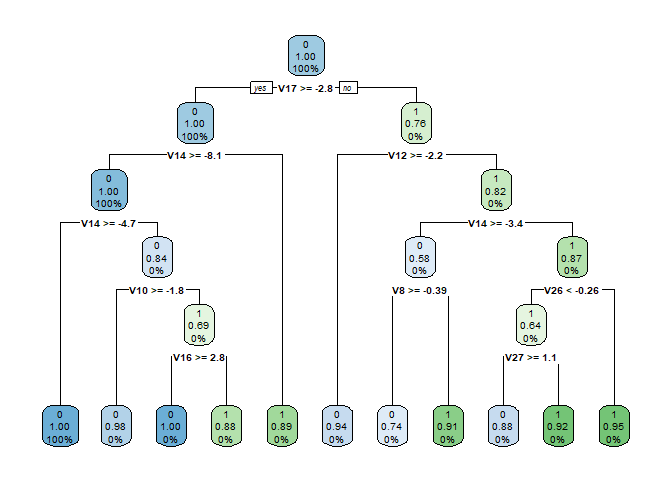
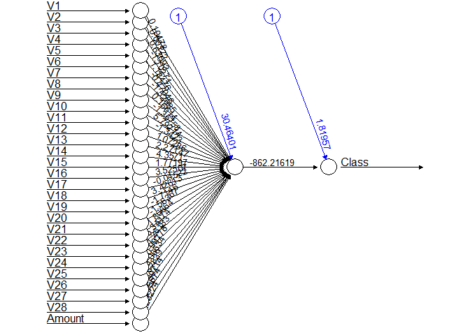
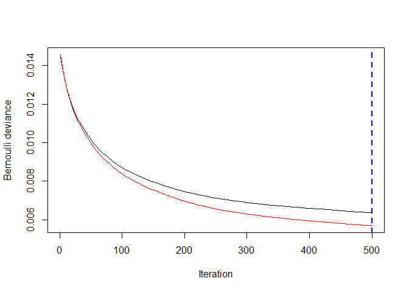
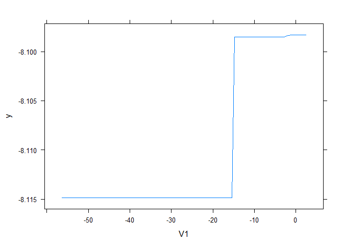
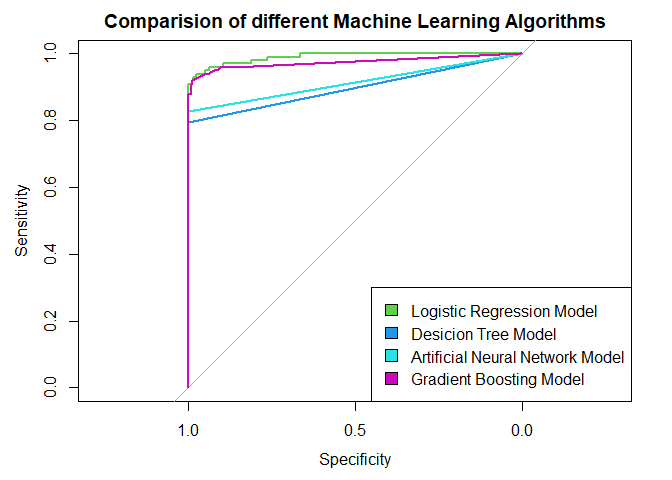

\newpage  
# 1. Importing the dataset  
  
In the section I shall first introduce and import the dataset that I have used in the whole project. That is the credit card transaction dataset available on *data-flair* website and can be easily downloaded from [**here**](https://drive.google.com/file/d/1CTAlmlREFRaEN3NoHHitewpqAtWS5cVQ/view) and also I shall be including several libraries here to be able to better explore and handle the given data.  

```r
library(ranger)
library(caret)
```

```
## Loading required package: lattice
```

```
## Loading required package: ggplot2
```

```r
library(data.table)
creditcard_data <- read.csv("creditcard.csv",header = TRUE)
```
\newpage  
# 2. Data Exploration  
  
In this section I shall explore the data that is now in our *creditcard_data* dataframe. I will proceed by displaying head, tail, column names and summary statistics of the dataset to get an idea of what we are working with.  

```r
dim(creditcard_data)
```

```
## [1] 284807     31
```

```r
head(creditcard_data,6)
```

```
##   Time         V1          V2        V3         V4          V5          V6
## 1    0 -1.3598071 -0.07278117 2.5363467  1.3781552 -0.33832077  0.46238778
## 2    0  1.1918571  0.26615071 0.1664801  0.4481541  0.06001765 -0.08236081
## 3    1 -1.3583541 -1.34016307 1.7732093  0.3797796 -0.50319813  1.80049938
## 4    1 -0.9662717 -0.18522601 1.7929933 -0.8632913 -0.01030888  1.24720317
## 5    2 -1.1582331  0.87773675 1.5487178  0.4030339 -0.40719338  0.09592146
## 6    2 -0.4259659  0.96052304 1.1411093 -0.1682521  0.42098688 -0.02972755
##            V7          V8         V9         V10        V11         V12
## 1  0.23959855  0.09869790  0.3637870  0.09079417 -0.5515995 -0.61780086
## 2 -0.07880298  0.08510165 -0.2554251 -0.16697441  1.6127267  1.06523531
## 3  0.79146096  0.24767579 -1.5146543  0.20764287  0.6245015  0.06608369
## 4  0.23760894  0.37743587 -1.3870241 -0.05495192 -0.2264873  0.17822823
## 5  0.59294075 -0.27053268  0.8177393  0.75307443 -0.8228429  0.53819555
## 6  0.47620095  0.26031433 -0.5686714 -0.37140720  1.3412620  0.35989384
##          V13        V14        V15        V16         V17         V18
## 1 -0.9913898 -0.3111694  1.4681770 -0.4704005  0.20797124  0.02579058
## 2  0.4890950 -0.1437723  0.6355581  0.4639170 -0.11480466 -0.18336127
## 3  0.7172927 -0.1659459  2.3458649 -2.8900832  1.10996938 -0.12135931
## 4  0.5077569 -0.2879237 -0.6314181 -1.0596472 -0.68409279  1.96577500
## 5  1.3458516 -1.1196698  0.1751211 -0.4514492 -0.23703324 -0.03819479
## 6 -0.3580907 -0.1371337  0.5176168  0.4017259 -0.05813282  0.06865315
##           V19         V20          V21          V22         V23         V24
## 1  0.40399296  0.25141210 -0.018306778  0.277837576 -0.11047391  0.06692807
## 2 -0.14578304 -0.06908314 -0.225775248 -0.638671953  0.10128802 -0.33984648
## 3 -2.26185710  0.52497973  0.247998153  0.771679402  0.90941226 -0.68928096
## 4 -1.23262197 -0.20803778 -0.108300452  0.005273597 -0.19032052 -1.17557533
## 5  0.80348692  0.40854236 -0.009430697  0.798278495 -0.13745808  0.14126698
## 6 -0.03319379  0.08496767 -0.208253515 -0.559824796 -0.02639767 -0.37142658
##          V25        V26          V27         V28 Amount Class
## 1  0.1285394 -0.1891148  0.133558377 -0.02105305 149.62     0
## 2  0.1671704  0.1258945 -0.008983099  0.01472417   2.69     0
## 3 -0.3276418 -0.1390966 -0.055352794 -0.05975184 378.66     0
## 4  0.6473760 -0.2219288  0.062722849  0.06145763 123.50     0
## 5 -0.2060096  0.5022922  0.219422230  0.21515315  69.99     0
## 6 -0.2327938  0.1059148  0.253844225  0.08108026   3.67     0
```

```r
tail(creditcard_data,6)
```

```
##          Time          V1          V2         V3         V4          V5
## 284802 172785   0.1203164  0.93100513 -0.5460121 -0.7450968  1.13031398
## 284803 172786 -11.8811179 10.07178497 -9.8347835 -2.0666557 -5.36447278
## 284804 172787  -0.7327887 -0.05508049  2.0350297 -0.7385886  0.86822940
## 284805 172788   1.9195650 -0.30125385 -3.2496398 -0.5578281  2.63051512
## 284806 172788  -0.2404400  0.53048251  0.7025102  0.6897992 -0.37796113
## 284807 172792  -0.5334125 -0.18973334  0.7033374 -0.5062712 -0.01254568
##                V6         V7         V8         V9        V10        V11
## 284802 -0.2359732  0.8127221  0.1150929 -0.2040635 -0.6574221  0.6448373
## 284803 -2.6068373 -4.9182154  7.3053340  1.9144283  4.3561704 -1.5931053
## 284804  1.0584153  0.0243297  0.2948687  0.5848000 -0.9759261 -0.1501888
## 284805  3.0312601 -0.2968265  0.7084172  0.4324540 -0.4847818  0.4116137
## 284806  0.6237077 -0.6861800  0.6791455  0.3920867 -0.3991257 -1.9338488
## 284807 -0.6496167  1.5770063 -0.4146504  0.4861795 -0.9154266 -1.0404583
##                V12        V13         V14         V15        V16         V17
## 284802  0.19091623 -0.5463289 -0.73170658 -0.80803553  0.5996281  0.07044075
## 284803  2.71194079 -0.6892556  4.62694203 -0.92445871  1.1076406  1.99169111
## 284804  0.91580191  1.2147558 -0.67514296  1.16493091 -0.7117573 -0.02569286
## 284805  0.06311886 -0.1836987 -0.51060184  1.32928351  0.1407160  0.31350179
## 284806 -0.96288614 -1.0420817  0.44962444  1.96256312 -0.6085771  0.50992846
## 284807 -0.03151305 -0.1880929 -0.08431647  0.04133346 -0.3026201 -0.66037665
##               V18        V19          V20        V21        V22         V23
## 284802  0.3731103  0.1289038 0.0006758329 -0.3142046 -0.8085204  0.05034266
## 284803  0.5106323 -0.6829197 1.4758291347  0.2134541  0.1118637  1.01447990
## 284804 -1.2211789 -1.5455561 0.0596158999  0.2142053  0.9243836  0.01246304
## 284805  0.3956525 -0.5772518 0.0013959703  0.2320450  0.5782290 -0.03750086
## 284806  1.1139806  2.8978488 0.1274335158  0.2652449  0.8000487 -0.16329794
## 284807  0.1674299 -0.2561169 0.3829481049  0.2610573  0.6430784  0.37677701
##                 V24        V25        V26          V27         V28 Amount Class
## 284802  0.102799590 -0.4358701  0.1240789  0.217939865  0.06880333   2.69     0
## 284803 -0.509348453  1.4368069  0.2500343  0.943651172  0.82373096   0.77     0
## 284804 -1.016225669 -0.6066240 -0.3952551  0.068472470 -0.05352739  24.79     0
## 284805  0.640133881  0.2657455 -0.0873706  0.004454772 -0.02656083  67.88     0
## 284806  0.123205244 -0.5691589  0.5466685  0.108820735  0.10453282  10.00     0
## 284807  0.008797379 -0.4736487 -0.8182671 -0.002415309  0.01364891 217.00     0
```
As we can see from the head and tail of the data, that there are total 31 different variables and 284807 observation of them. To check the important variables or choose our decision variables we shall check their names first.  

```r
names(creditcard_data)
```

```
##  [1] "Time"   "V1"     "V2"     "V3"     "V4"     "V5"     "V6"     "V7"    
##  [9] "V8"     "V9"     "V10"    "V11"    "V12"    "V13"    "V14"    "V15"   
## [17] "V16"    "V17"    "V18"    "V19"    "V20"    "V21"    "V22"    "V23"   
## [25] "V24"    "V25"    "V26"    "V27"    "V28"    "Amount" "Class"
```
As we can see there are only 3 named variables in the dataset which are  
- Time  
- Amount  
- Class  
Other variable names have been removed or hidden because of them being proprietary information or internal commercial information to protect the company privacy and to allow them to maintain the competitive edge in market.
Here time is pretty much self explanatory as it records time of the particular transaction in question. So we shall see what classes are present and what amounts of transactions are made.  

```r
table(creditcard_data$Class)
```

```
## 
##      0      1 
## 284315    492
```

```r
summary(creditcard_data$Amount)
```

```
##     Min.  1st Qu.   Median     Mean  3rd Qu.     Max. 
##     0.00     5.60    22.00    88.35    77.17 25691.16
```

```r
var(creditcard_data$Amount)
```

```
## [1] 62560.07
```

```r
sd(creditcard_data$Amount)
```

```
## [1] 250.1201
```
Now we have a good general idea of the amount of transactions made and they are classified into 2 classes. Where class 0 are normal credit card transactions and class 1 transactions that are flagged as fraudulent by the system. In short:  
- *Class 0* - Non-fraudulent  
- *Class 1* - Fraudulent  
  
\newpage  
  
# 3. Data manipulation  
  
In this section I shall scale the data using *scale()* function. I will apply this the the amount component of the credit card data. Scaling is also known as feature standardization. With the help of scaling, the data is structured according to a specified range. Therefor, there are no extreme values in our dataset that might interfere with the functioning of the model. We shall carry it out as follows:  

```r
creditcard_data$Amount <- scale(creditcard_data$Amount)
NewData <- creditcard_data[,-c(1)]
head(NewData)
```

```
##           V1          V2        V3         V4          V5          V6
## 1 -1.3598071 -0.07278117 2.5363467  1.3781552 -0.33832077  0.46238778
## 2  1.1918571  0.26615071 0.1664801  0.4481541  0.06001765 -0.08236081
## 3 -1.3583541 -1.34016307 1.7732093  0.3797796 -0.50319813  1.80049938
## 4 -0.9662717 -0.18522601 1.7929933 -0.8632913 -0.01030888  1.24720317
## 5 -1.1582331  0.87773675 1.5487178  0.4030339 -0.40719338  0.09592146
## 6 -0.4259659  0.96052304 1.1411093 -0.1682521  0.42098688 -0.02972755
##            V7          V8         V9         V10        V11         V12
## 1  0.23959855  0.09869790  0.3637870  0.09079417 -0.5515995 -0.61780086
## 2 -0.07880298  0.08510165 -0.2554251 -0.16697441  1.6127267  1.06523531
## 3  0.79146096  0.24767579 -1.5146543  0.20764287  0.6245015  0.06608369
## 4  0.23760894  0.37743587 -1.3870241 -0.05495192 -0.2264873  0.17822823
## 5  0.59294075 -0.27053268  0.8177393  0.75307443 -0.8228429  0.53819555
## 6  0.47620095  0.26031433 -0.5686714 -0.37140720  1.3412620  0.35989384
##          V13        V14        V15        V16         V17         V18
## 1 -0.9913898 -0.3111694  1.4681770 -0.4704005  0.20797124  0.02579058
## 2  0.4890950 -0.1437723  0.6355581  0.4639170 -0.11480466 -0.18336127
## 3  0.7172927 -0.1659459  2.3458649 -2.8900832  1.10996938 -0.12135931
## 4  0.5077569 -0.2879237 -0.6314181 -1.0596472 -0.68409279  1.96577500
## 5  1.3458516 -1.1196698  0.1751211 -0.4514492 -0.23703324 -0.03819479
## 6 -0.3580907 -0.1371337  0.5176168  0.4017259 -0.05813282  0.06865315
##           V19         V20          V21          V22         V23         V24
## 1  0.40399296  0.25141210 -0.018306778  0.277837576 -0.11047391  0.06692807
## 2 -0.14578304 -0.06908314 -0.225775248 -0.638671953  0.10128802 -0.33984648
## 3 -2.26185710  0.52497973  0.247998153  0.771679402  0.90941226 -0.68928096
## 4 -1.23262197 -0.20803778 -0.108300452  0.005273597 -0.19032052 -1.17557533
## 5  0.80348692  0.40854236 -0.009430697  0.798278495 -0.13745808  0.14126698
## 6 -0.03319379  0.08496767 -0.208253515 -0.559824796 -0.02639767 -0.37142658
##          V25        V26          V27         V28      Amount Class
## 1  0.1285394 -0.1891148  0.133558377 -0.02105305  0.24496383     0
## 2  0.1671704  0.1258945 -0.008983099  0.01472417 -0.34247394     0
## 3 -0.3276418 -0.1390966 -0.055352794 -0.05975184  1.16068389     0
## 4  0.6473760 -0.2219288  0.062722849  0.06145763  0.14053401     0
## 5 -0.2060096  0.5022922  0.219422230  0.21515315 -0.07340321     0
## 6 -0.2327938  0.1059148  0.253844225  0.08108026 -0.33855582     0
```
\newpage  
# 4. Data Modeling  
  
After now that the dataset has been standardized, we shall split it into 2 parts; training data and test data, with a split ration of 80-20. Which means 80% of the data shall be used to train the model while we shall test the trained model using the remaining 20% of the data.  

```r
library(caTools)
set.seed(69420)
data_sample <- sample.split(NewData$Class,SplitRatio = 0.80)
train_data <- subset(NewData,data_sample==TRUE)
test_data <- subset(NewData,data_sample==FALSE)
dim(train_data)
```

```
## [1] 227846     30
```

```r
dim(test_data)
```

```
## [1] 56961    30
```
\newpage  
  
# 5. Fitting Logistic Regression Model  
  
In this section we shall fit the first model. We begin with logistic regression. A logistic regression is used to model outcome probabilities of a class such as pass/fail, negative/positive or as in our case fraud/not fraud. We proceed to implement this model on our training data as following:  

```r
Logistic_Model <- glm(Class~.,train_data,family = binomial())
summary(Logistic_Model)
```

```
## 
## Call:
## glm(formula = Class ~ ., family = binomial(), data = train_data)
## 
## Deviance Residuals: 
##     Min       1Q   Median       3Q      Max  
## -4.6961  -0.0296  -0.0197  -0.0130   4.5565  
## 
## Coefficients:
##             Estimate Std. Error z value Pr(>|z|)    
## (Intercept) -8.59697    0.16134 -53.285  < 2e-16 ***
## V1           0.06099    0.04633   1.316 0.188030    
## V2           0.06232    0.07427   0.839 0.401421    
## V3           0.01583    0.05038   0.314 0.753318    
## V4           0.67933    0.08280   8.205 2.31e-16 ***
## V5           0.16042    0.07426   2.160 0.030748 *  
## V6          -0.12183    0.08074  -1.509 0.131336    
## V7          -0.09466    0.07718  -1.226 0.220027    
## V8          -0.15359    0.03403  -4.514 6.37e-06 ***
## V9          -0.21749    0.12309  -1.767 0.077251 .  
## V10         -0.77918    0.10888  -7.157 8.27e-13 ***
## V11         -0.01728    0.08366  -0.207 0.836372    
## V12          0.06053    0.09458   0.640 0.522154    
## V13         -0.29899    0.08973  -3.332 0.000862 ***
## V14         -0.52923    0.06778  -7.808 5.82e-15 ***
## V15         -0.14863    0.09289  -1.600 0.109609    
## V16         -0.16948    0.14166  -1.196 0.231544    
## V17          0.01010    0.07582   0.133 0.894059    
## V18         -0.05617    0.14436  -0.389 0.697211    
## V19          0.06319    0.10705   0.590 0.555013    
## V20         -0.43276    0.09295  -4.656 3.23e-06 ***
## V21          0.35809    0.06511   5.500 3.79e-08 ***
## V22          0.61083    0.14164   4.312 1.61e-05 ***
## V23         -0.05895    0.07046  -0.837 0.402747    
## V24          0.14955    0.16152   0.926 0.354520    
## V25         -0.11599    0.14031  -0.827 0.408420    
## V26          0.09388    0.20615   0.455 0.648836    
## V27         -0.74042    0.13638  -5.429 5.66e-08 ***
## V28         -0.25725    0.09824  -2.619 0.008831 ** 
## Amount       0.27327    0.12982   2.105 0.035292 *  
## ---
## Signif. codes:  0 '***' 0.001 '**' 0.01 '*' 0.05 '.' 0.1 ' ' 1
## 
## (Dispersion parameter for binomial family taken to be 1)
## 
##     Null deviance: 5799.1  on 227845  degrees of freedom
## Residual deviance: 1837.7  on 227816  degrees of freedom
## AIC: 1897.7
## 
## Number of Fisher Scoring iterations: 12
```
Now that we have summarized our model we shall visualize it.  

```r
plot(Logistic_Model)
```


Now that we have our model, in order to asses it; we will delineate the ROC curve. ROC is known as the Receiver Operator Characteristic. It is a graphical plot used to show the diagnostic ability of binary classifiers. Such as in our case fraud/not fraud. ROC is created using plotting the True positive rate (TPR) against the false positive rate (FPR). Hence it shows the trade-off between sensitivity and specificity. Hence closer the curve is to top left of the graph better fit of the model and closer it is to the 45-degree line, less accurate the fit.  
For this, we will first import the ROC package and then plot our ROC curve to analyze its performance.  

```r
library(pROC)
lr.predict <- predict(Logistic_Model,test_data, probability = TRUE)
auc.gbm <- roc(test_data$Class, lr.predict, plot = TRUE, col = "blue")
```

```
## Setting levels: control = 0, case = 1
```

```
## Setting direction: controls < cases
```


As we can see, a simple straight forward logistic regression model also gives us a very good fit to the test data and we can use this to classify future fraudulent transactions as well. But we shall see that using other algorithms can we make this model even better or not.  
\newpage  
  
# 6. Fitting a Decision Tree Model  
  
In this section we shall implement a decision tree algorithm and plot it using *rpart* and *rpart.plot* packages. Decision trees are plots of outcomes of decisions. And these outcomes are basically a consequence through which we can conclude as to what class the object belongs to. Also we shall use specifically recursive parting to plot the decision tree. We shall implement it as follows:  

```r
library(rpart)
library(rpart.plot)
decisionTree_model <- rpart(Class~.,creditcard_data,method = 'class')
predicted_val <- predict(decisionTree_model,creditcard_data,type='class')
probability <- predict(decisionTree_model,creditcard_data,type='prob')
rpart.plot(decisionTree_model,extra = 108)
```


From this decision tree we can see that which variables are key in terms of determining which transactions might be fraudulent. Here green blocks show fraudulent transactions and blue blocks suggest non-fraudulent transactions. Also darker the shade of a block with higher certainty we can say if a transaction is fraudulent or not. The number in first row of each block is which class the transaction belongs to and second row shows the portion of above chunk going into the particular block.  
\newpage  
  
# 7. Artificial Neural Network  
  
Artificial Neural Networks are a type of machine learning algorithm that are modeled after the human nervous system. The ANN models are able to learn the patterns using historical data and are able to perform classification on the input data.  
We import the *neuralnet* package that would allow us to implement our ANNs. Then we proceed to plot it using *plot()* function.  
Here, in the case of Artificial Neural Networks, there is a range of values that is between 1 and 0. We set a threshold as 0.5; that is, values above 0.5 will correspond to class 1(ie fraudulent) and the rest will be 0(ie non-fraudulent). We implement this as follows:  

```r
library(neuralnet)
ANN_model <- neuralnet (Class~.,train_data,linear.output=FALSE)
```

```r
plot(ANN_model, rep = "best")
```



Now we shall use this trained model to check versus our test data and see how well it fits.  

```r
predANN <- compute(ANN_model,test_data)
resultANN <- predANN$net.result
resultANN <- ifelse(resultANN>0.5,1,0)
```
\newpage  
  
# 8. Gradient Boosting (GBM)  
  
This is a popular machine learning algorithm that is used to perform classification and regression tasks. This model comprises of several underlying ensemble models like weak decision trees. These decision trees combine together to form a strong model of gradient boosting. We will implement this as follows:  

```r
library(gbm, quietly = TRUE)
```
First we shall get the time to train the GB Model.  

```r
system.time(
       model_gbm <- gbm(Class ~ .
               , distribution = "bernoulli"
               , data = rbind(train_data, test_data)
               , n.trees = 500
               , interaction.depth = 3
               , n.minobsinnode = 100
               , shrinkage = 0.01
               , bag.fraction = 0.5
               , train.fraction = nrow(train_data) / (nrow(train_data) + nrow(test_data))
               )
)
```

```
##    user  system elapsed 
##  243.85    0.14  245.12
```
Now that we have it, we shall determine the best iteration based on test data.  

```r
gbm.iter <- gbm.perf(model_gbm, method = "test")
```

<!-- -->
Now we shall influence this model using the gradient boosting algorithm and plot it. And also create a second prediction variable for the test data as well.  

```r
model.influence <- relative.influence(model_gbm, n.trees = gbm.iter, sort. = TRUE)
plot(model_gbm)
```



```r
gbm_test <- predict(model_gbm, newdata = test_data, n.trees = gbm.iter)
```
\newpage  
  
# 9. Comparision of all models  
  
Now in this section we shall create multiple ROC objects and show them all on a single plot in order to understand which model best fits our test data using the given training sample and based on it we shall draw our conclusions.  

```r
library(pROC)
LogisticRegression <- roc(test_data$Class, as.numeric(lr.predict), plot = FALSE)
```

```
## Setting levels: control = 0, case = 1
```

```
## Setting direction: controls < cases
```

```r
DesicionTree <- roc(creditcard_data$Class, as.numeric(predicted_val),plot = FALSE)
```

```
## Setting levels: control = 0, case = 1
## Setting direction: controls < cases
```

```r
ArtificialNeuralNetwork <- roc(test_data$Class, as.numeric(resultANN),plot = FALSE)
```

```
## Setting levels: control = 0, case = 1
## Setting direction: controls < cases
```

```r
GradientBoostingModel <- roc(test_data$Class, as.numeric(gbm_test),plot = FALSE)
```

```
## Setting levels: control = 0, case = 1
## Setting direction: controls < cases
```

```r
plot(LogisticRegression,main = "Comparision of different Machine Learning Algorithms", col=3)
lines(DesicionTree, col=4)
lines(ArtificialNeuralNetwork, col=5)
lines(GradientBoostingModel, col=6)
legend(x="bottomright", 
       legend = c("Logistic Regression Model", 
                  "Desicion Tree Model", "Artificial Neural Network Model", 
                  "Gradient Boosting Model"), 
       fill = 3:6)
```


\newpage  
  
# 10. Conclusion  
  
As we can see from the graph above, the logistic regression model has the highest area under the curve; ie. it is the best fitting model to our given data. Hence we can say in future; logistic regression is the best kind of model to classify only 2 state based credit card fraud detection.  
And we can use this to recommend it to use for real life data to detect credit card fraud and flag the seemingly  fraudulent transactions.  
  
***  
  
\newpage  
  
To recreate any of the above performed calculations here is the list of all packages and environment conditions given.  

```r
sessionInfo()
```

```
## R version 4.0.3 (2020-10-10)
## Platform: x86_64-w64-mingw32/x64 (64-bit)
## Running under: Windows 10 x64 (build 19042)
## 
## Matrix products: default
## 
## locale:
## [1] LC_COLLATE=English_India.1252  LC_CTYPE=English_India.1252   
## [3] LC_MONETARY=English_India.1252 LC_NUMERIC=C                  
## [5] LC_TIME=English_India.1252    
## 
## attached base packages:
## [1] stats     graphics  grDevices utils     datasets  methods   base     
## 
## other attached packages:
##  [1] gbm_2.1.8         neuralnet_1.44.2  rpart.plot_3.0.9  rpart_4.1-15     
##  [5] pROC_1.17.0.1     data.table_1.13.2 caret_6.0-86      ggplot2_3.3.2    
##  [9] lattice_0.20-41   ranger_0.12.1     caTools_1.18.0   
## 
## loaded via a namespace (and not attached):
##  [1] tidyselect_1.1.0     xfun_0.19            reshape2_1.4.4      
##  [4] purrr_0.3.4          splines_4.0.3        colorspace_1.4-1    
##  [7] vctrs_0.3.4          generics_0.1.0       stats4_4.0.3        
## [10] htmltools_0.5.0      yaml_2.2.1           survival_3.2-7      
## [13] prodlim_2019.11.13   rlang_0.4.8          ModelMetrics_1.2.2.2
## [16] pillar_1.4.6         glue_1.4.2           withr_2.3.0         
## [19] foreach_1.5.1        lifecycle_0.2.0      plyr_1.8.6          
## [22] lava_1.6.8.1         stringr_1.4.0        timeDate_3043.102   
## [25] munsell_0.5.0        gtable_0.3.0         recipes_0.1.15      
## [28] codetools_0.2-16     evaluate_0.14        knitr_1.30          
## [31] class_7.3-17         Rcpp_1.0.5           scales_1.1.1        
## [34] ipred_0.9-9          digest_0.6.26        stringi_1.5.3       
## [37] dplyr_1.0.2          grid_4.0.3           tools_4.0.3         
## [40] bitops_1.0-6         magrittr_1.5         tibble_3.0.4        
## [43] crayon_1.3.4         pkgconfig_2.0.3      ellipsis_0.3.1      
## [46] MASS_7.3-53          Matrix_1.2-18        lubridate_1.7.9.2   
## [49] gower_0.2.2          rmarkdown_2.6        rstudioapi_0.11     
## [52] iterators_1.0.13     R6_2.4.1             nnet_7.3-14         
## [55] nlme_3.1-149         compiler_4.0.3
```
***
